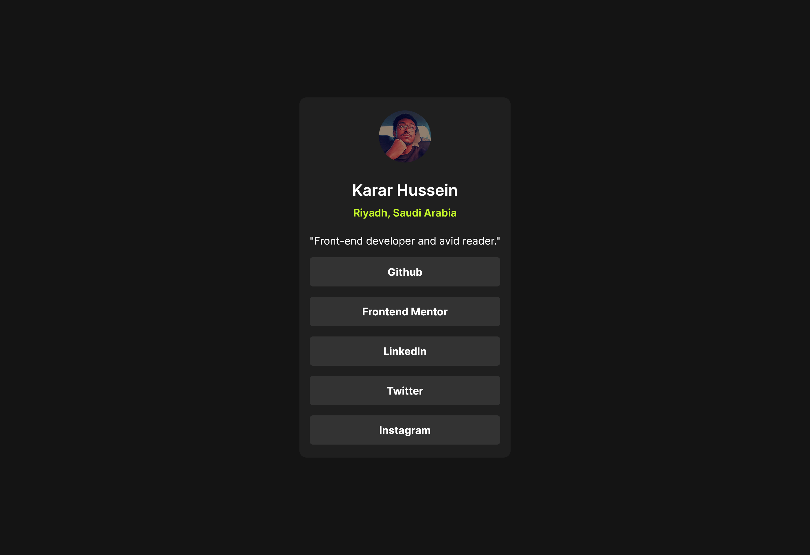

# Frontend Mentor - Social links profile solution

This is a solution to the [Social links profile challenge on Frontend Mentor](https://www.frontendmentor.io/challenges/social-links-profile-UG32l9m6dQ).

## Table of contents

- [Overview](#overview)
  - [Screenshot](#screenshot)
  - [Links](#links)
- [My process](#my-process)
  - [Built with](#built-with)
- [Author](#author)

## Overview

### Screenshot

### Links

- Live Site URL: [https://karrar-hussein.github.io/social-links-profile-component/](https://karrar-hussein.github.io/social-links-profile-component/)

## My process

### Built with

- Semantic HTML5 markup
- CSS custom properties
- CSS Grid
- Mobile-first workflows

## Author

- Linkedin - [Karar Hussein](https://www.linkedin.com/in/khusseincoder)
- Frontend Mentor - [@Karrar-Hussein](https://www.frontendmentor.io/profile/Karrar-Hussein)
- Twitter - [@khusseincoder](https://x.com/khusseincoder)
